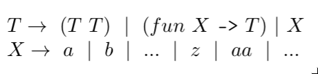

# Notes 9: NanOCaml Syntax

Date: Tuesday July 2nd

<!--- ADMIN: Quiz today. -->

<!--- TIME: 40 minutes -->

## Syntax and semantics

When defining programming languages, we usually make the following
distinction.

* The **syntax** of a language is what it looks like.
* The **semantics** of a language is what the components mean.

Both are critical aspects of language design.


## The NanOCaml grammar

We are implementing a stripped down version of OCaml called NanOCaml.
Today, we will focus only on the syntax of NanOCaml, in other words
writing the lexer and parser.



This is a context-free grammar, although often times in practice an
equivalent but slightly different type of grammar is used called
Backus-Naur form (or BNF).

**Example.** Prove that the string `((fun x -> x) y)` is in the
NanOCaml language.

**Proof.** To do so we provide a left-most (or right-most) derivation
of the string, starting from the starting non-terminal `T`.

```
T -> (T T) -> ((fun X -> T) T) -> ((fun x -> T) T)
  -> ((fun x -> X) T) -> ((fun x -> x) T) -> ((fun x -> x) X)
  -> ((fun x -> x) y)
```

Simply giving the derivation is proof that the string is in our
language.

## A variant

This grammar was carefully designed to make all the parentheses
explicit. Suppose we had a variation of NanOCaml that didn't do
this.


This is problematic because the grammar is now ambiguous. Introducing
non-parenthesized application leaves ambiguous how to associate
application.

**Example.** Prove that the grammar above is ambiguous.

**Proof.** We provide two left-most derivations of the same string.
For this example, I will provide two left-most derivation so `f a b`.

```
1. T -> T T -> T T T -> X T T -> f T T -> f X T -> f a T -> f a X -> f a b
2. T -> T T -> X T T -> f T T -> f X T -> f a T -> f a X -> f a b
```

The first derivation has a parse tree that associates to the left
(this is our normal associativity for function application). Whereas
the second associates to the right. This is not desirable.

We could modify the grammar to force associativity on one side (this
would fix the ambiguity problem and indeed this is what you'll do in
the SmallC project). But our original grammar works fine since it
forces parentheses on everything.

## NanOCaml in OCaml

Back to the grammar we had earlier. We need to write a lexer and
parser so the first step is to come up with the correct data types.
We need a token type for the lexer and an AST type for the parser.


This grammar implies a natural set of tokens.

```ocaml
type token =
  Tok_Fun              (* fun *)
| Tok_Var of string    (* [a-z]+ *)
| Tok_Arrow            (* -> *)
| Tok_LParen           (* ( *)
| Tok_RParen           (* ) *)
| Tok_EOF              (* end of file *)
```

And a natural abstract syntax tree.

```ocaml
type var = string
type expr =
  Fun of var * expr
| App of expr * expr
| Var of var
```

Here is an example input and how it should turn out from each
of your functions.

```ocaml
Lexer.lex "((fun x -> x) y)" =
[Tok_LParen; Tok_LParen; Tok_Fun; Tok_Var "x";
 Tok_Arrow; Tok_Var "x"; Tok_RParen;
  Tok_Var "y"; Tok_RParen; Tok_EOF]

(Parser.parse (Lexer.lex "((fun x -> x) y)")) =
App (Fun ("x", Var "x"), Var "y")
```

## Fixing the grammar

There is one major problem with our grammar though. It has
conflicting first sets! Therefore, it cannot be parsed with
a recursive descent parser as is. We can fix that with
left factoring.


If you want more practice on making CFGs suitable for
recursive descent, take a look at
[these more extensive notes](http://camoy.name/words/descent).

<!--- TIME: 40 minutes -->
<!--- CUE: Have students work on the graded exercise. -->
