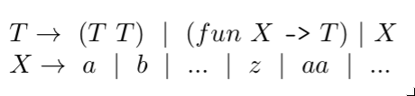

# Discussion 9: NanOCaml Syntax

Due: Tuesday July 2nd at 11:59:59PM

Points: 60P/40R/0S

## Introduction

We are implementing a stripped down version of OCaml called NanOCaml.
Today, we will focus only on the syntax of NanOCaml, in other words
writing the lexer and parser.

Note that whitespace will be ignored (does not appear in the token
list), although it can be used to indicate separate tokens. For
example, `ab` will be lexed as `[Tok_Var "ab"; Tok_EOF]`,
but `a b` will be lexed as `[Tok_Var "a"; Tok_Var "b"; Tok_EOF]`.

You are only required to implement the following four functions.
However, you will surely write several other helper functions.
You may use the [lexer and parser examples](https://github.com/anwarmamat/cmsc330summer19-public/tree/master/notes/cfgs)
given in class as a guide.

* `lex : string -> token list`
* `string_of_tokens : token list -> string`
* `parse : token list -> expr`
* `string_of_expr : expr -> string`
